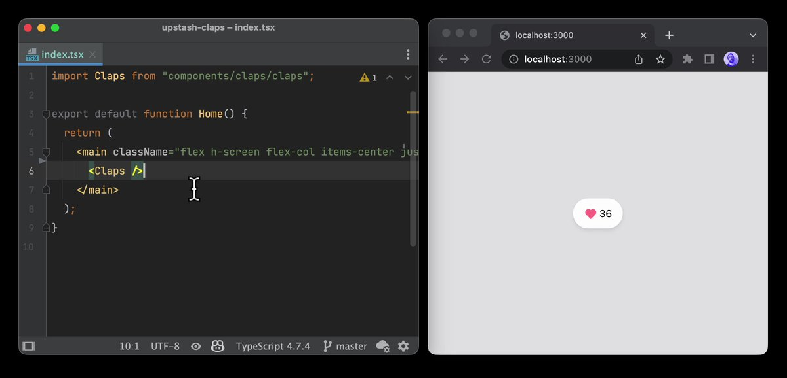

# @upstash/claps

Add a claps button (like medium) to any page for your Next.js apps.

Nothing to maintain, it is completely serverless 💯

Check out [the demo](https://upstash-claps.vercel.app).

<a href="https://twitter.com/ademilter/status/1550595499048198144">

</a>

### 1. Create Database

Create a free Redis database at [Upstash Console](https://console.upstash.com)

> We will use [Upstash Redis](https://upstash.com) to keep the data as well as
> messaging (Redis pub/sub).

### 2. Environment Variables

Copy the `.env.local.example` file to `.env.local` (which will be ignored by
Git):

```bash
cp .env.local.example .env.local
```

> `UPSTASH_REDIS_REST_URL` and `UPSTASH_REDIS_REST_TOKEN` can be found at the
> database details page in Upstash Console.

### 3. Install Package

```bash
yarn add @upstash/claps
```

### 4. Import CSS

```jsx
// pages/_app.js
import "@upstash/claps/style.css";

export default function MyApp({ Component, pageProps }) {
  return <Component {...pageProps} />;
}
```

### 4. Import Components

```jsx
// pages/example.js
import Claps from "@upstash/claps";

export default function Example() {
  return (
    <div>
        <Claps fixed="left">
    </div>
  )
}
```

The options can be passed as React props

| key            | type                        | default      |
| -------------- | --------------------------- | ------------ |
| `key?`         | `string`                    |              |
| `fixed?`       | `"left", "center", "right"` |              |
| `replyUrl?`    | `string`                    |              |
| `replyCount?`  | `string`                    |              |
| `apiPath?`     | `string`                    | `/api/claps` |
| `iconClap?`    | `null, React.ReactElement`  |              |
| `iconReply?`   | `null, React.ReactElement`  |              |
| `shareButton?` | `boolean`                   | `true`       |

> Url of the page is being used as the key/identity to keep the claps count. You
> can override this giving the `key` attribute.

### 5. Create API

```js
// pages/api/claps.js
import createClapsAPI from "@upstash/claps/api";

const ClapsAPI = createClapsAPI({
  // maxClaps: 10
});
export default ClapsAPI;
```

### Support

Use [Upstash Discord](https://upstash.com/discord) channel to get support.
